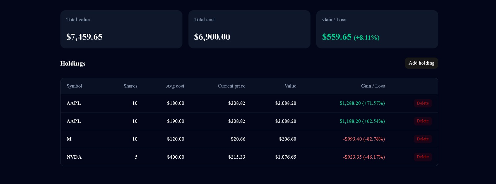
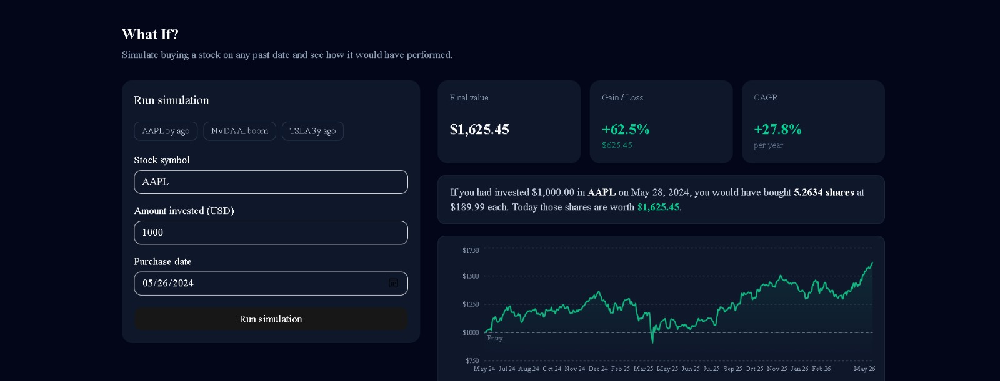
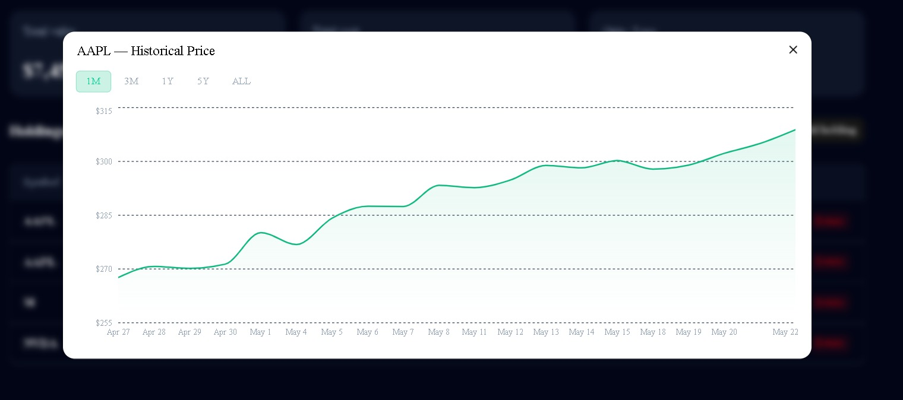
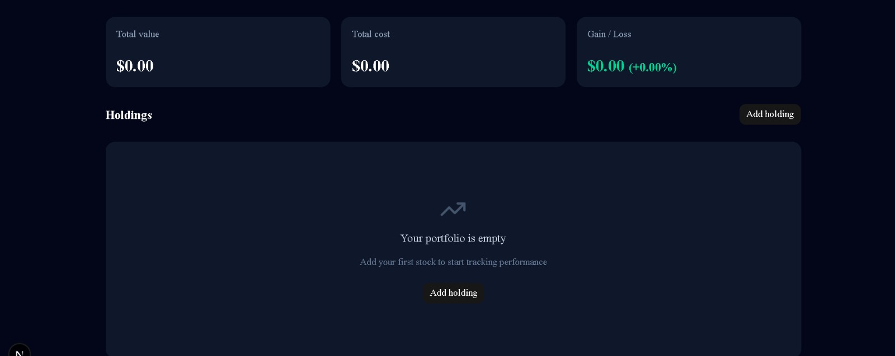

<div align="center">

# 📈 StockTrack

**Track your stocks. Explore history. Simulate the past.**

[](https://stocktrack-iota.vercel.app)
[](./LICENSE)
[](https://nextjs.org)
[](https://www.typescriptlang.org)
[](https://www.mongodb.com/atlas)

<br/>

<a href="#-español">🇲🇽 Español</a> &nbsp;|&nbsp; <a href="#-english">🇺🇸 English</a>

</div>

---

## 🇲🇽 Español

## 🌐 Demo en vivo

👉 **[stocktrack-iota.vercel.app](https://stocktrack-iota.vercel.app)**

Inicia sesión con tu cuenta de Google para probar el dashboard, agregar acciones a tu portafolio, y correr simulaciones retrospectivas.

### ¿Qué es StockTrack?

Dashboard de portafolio bursátil con datos reales de mercado y simulación retrospectiva. Permite trackear tus acciones, visualizar la performance histórica por símbolo, y simular qué habría pasado si hubieras invertido en un stock en una fecha específica del pasado — incluyendo el cálculo de CAGR.

### Features principales

- 🔐 **Autenticación con Google OAuth** — Login sin contraseñas usando NextAuth.js y sesiones almacenadas en MongoDB
- 📊 **Dashboard de holdings** — Vista de portafolio con precio actual, costo promedio, valor total y ganancia/pérdida por posición
- 💹 **Precios en tiempo real** — Datos de mercado vía Twelve Data API con cache TTL de 5 minutos en MongoDB
- 📉 **Gráficas históricas** — Precio de cierre ajustado con rangos 1M / 3M / 1Y / 5Y / ALL por símbolo
- ⏪ **Simulador retrospectivo (backtest)** — Simula una inversión histórica y calcula ganancia, rendimiento y CAGR anualizado
- 💾 **Cache estratificado** — Precios actuales: TTL 5 min · Datos históricos: cache permanente actualizado 1×/día
- 🌑 **Dark theme + diseño responsive** — UI construida con Tailwind CSS y shadcn/ui
- 🔒 **Multi-tenant** — Todas las queries filtran por `user.id` de sesión; un usuario nunca accede a datos de otro

### Stack tecnológico

| Capa | Tecnología |
|------|------------|
| Framework | Next.js 16 (App Router + Server Actions) |
| Lenguaje | TypeScript 5 |
| UI | Tailwind CSS 4 + shadcn/ui (@base-ui/react) |
| Auth | NextAuth.js 4 + Google OAuth 2.0 |
| Base de datos | MongoDB Atlas + Mongoose 8 |
| Market data | Twelve Data API (800 req/día free tier) |
| Charts | Recharts 3 |
| Notificaciones | Sonner |
| Deploy | Vercel + MongoDB Atlas |

### Capturas de pantalla

| Dashboard | Backtest |
|-----------|----------|
|  |  |

| Gráfica histórica | Empty state |
|-------------------|-------------|
|  |  |

### Arquitectura

```
[Browser] ──→ [Next.js App — Vercel]
                       │
              [Server Components]
              [Server Actions]
                       │
          ┌────────────┴────────────┐
          ▼                         ▼
  [MongoDB Atlas]          [Twelve Data API]
  ┌──────────────┐         ┌───────────────┐
  │ sessions     │         │ /quote        │
  │ holdings     │         │ /time_series  │
  │ price_caches │         └───────────────┘
  │ hist_caches  │
  └──────────────┘
```

### Decisiones técnicas

| Decisión | Justificación |
|----------|---------------|
| Server Actions sobre API Routes | Menos boilerplate, type-safe end-to-end, sin fetch manual |
| Cache estratificado | Precios actuales (volátiles) → TTL 5 min · Históricos (inmutables) → 1×/día |
| Twelve Data vs Alpha Vantage | 800 req/día free tier vs 25; históricos completos incluidos |
| NextAuth con strategy `database` | Sesiones persistentes, revocación inmediata, sin JWT expuesto al cliente |
| Backtest determinístico | Sin IA: cálculos matemáticos sobre datos históricos reales (CAGR, sharesEquivalent) |
| Multi-tenant en queries | `{ user: session.user.id }` en todas las operaciones de holdings — nunca se filtra por omisión |

### Cómo correrlo localmente

**Prerequisitos:** Node.js 20+, cuenta MongoDB Atlas, proyecto Google Cloud con OAuth habilitado, API key de Twelve Data.

```bash
git clone https://github.com/MiguelC121913/StockTrack.git
cd StockTrack
npm install
cp .env.example .env.local
# Editar .env.local con tus valores
npm run dev
```

Abre [http://localhost:3000](http://localhost:3000).

Para guía detallada de cada variable de entorno → [docs/SETUP.md](./docs/SETUP.md)

> 💡 **Tip**: Si solo quieres ver el proyecto en acción sin configurar nada, usa el [demo en vivo](https://stocktrack-iota.vercel.app).

### Limitaciones conocidas

- Twelve Data free tier: histórico máximo ~5000 registros (~14 años de datos diarios)
- Cold start en Vercel free tier: ~2-3 segundos en primera carga
- Sin tests automatizados (planeados para siguiente iteración)
- Sin paginación en holdings (diseñado para portfolios personales, <100 posiciones)

### Roadmap

- [ ] Tests con Vitest + Playwright E2E
- [ ] Alertas de precio con notificaciones push
- [ ] Exportar portfolio a CSV
- [ ] Comparación con índices (S&P 500, NASDAQ)
- [ ] Soporte para criptomonedas vía CoinGecko API
- [ ] App móvil React Native

### Autor

**Miguel Ángel Córdova Salcido**

- 🔗 [linkedin.com/in/miguel-angel-córdova](https://linkedin.com/in/miguel-angel-córdova)
- 🐙 [github.com/MiguelC121913](https://github.com/MiguelC121913)
- 📁 Otros proyectos: [CAPUN](https://github.com/MiguelC121913) · [SmartBudget](https://github.com/MiguelC121913)

---

## 🇺🇸 English

## 🌐 Live demo

👉 **[stocktrack-iota.vercel.app](https://stocktrack-iota.vercel.app)**

Sign in with your Google account to try the dashboard, add stocks to your portfolio, and run retrospective backtests.

### What is StockTrack?

A stock portfolio dashboard with real market data and retrospective simulation. Track your holdings, explore a symbol's full price history, and simulate what would have happened if you had invested in any stock on any date in the past — including annualized CAGR.

### Key features

- 🔐 **Google OAuth authentication** — Passwordless login via NextAuth.js with sessions stored in MongoDB
- 📊 **Holdings dashboard** — Portfolio view with current price, average cost, total value, and gain/loss per position
- 💹 **Live market prices** — Real-time data via Twelve Data API with a 5-minute TTL cache in MongoDB
- 📉 **Historical charts** — Adjusted close price with 1M / 3M / 1Y / 5Y / ALL ranges per symbol
- ⏪ **Backtest simulator** — Simulate a historical investment and compute gain, return percentage, and annualized CAGR
- 💾 **Tiered cache** — Current prices: 5-min TTL · Historical data: permanent cache refreshed once per day
- 🌑 **Dark theme + responsive design** — Built with Tailwind CSS 4 and shadcn/ui
- 🔒 **Multi-tenant security** — Every query scopes to `user.id` from the session; users can never access each other's data

### Tech stack

| Layer | Technology |
|-------|------------|
| Framework | Next.js 16 (App Router + Server Actions) |
| Language | TypeScript 5 |
| UI | Tailwind CSS 4 + shadcn/ui (@base-ui/react) |
| Auth | NextAuth.js 4 + Google OAuth 2.0 |
| Database | MongoDB Atlas + Mongoose 8 |
| Market data | Twelve Data API (800 req/day free tier) |
| Charts | Recharts 3 |
| Notifications | Sonner |
| Deploy | Vercel + MongoDB Atlas |

### Screenshots

| Dashboard | Backtest |
|-----------|----------|
|  |  |

| Historical chart | Empty state |
|------------------|-------------|
|  |  |

### Architecture

```
[Browser] ──→ [Next.js App — Vercel]
                       │
              [Server Components]
              [Server Actions]
                       │
          ┌────────────┴────────────┐
          ▼                         ▼
  [MongoDB Atlas]          [Twelve Data API]
  ┌──────────────┐         ┌───────────────┐
  │ sessions     │         │ /quote        │
  │ holdings     │         │ /time_series  │
  │ price_caches │         └───────────────┘
  │ hist_caches  │
  └──────────────┘
```

### Technical decisions

| Decision | Rationale |
|----------|-----------|
| Server Actions over API Routes | Less boilerplate, type-safe end-to-end, no manual fetch |
| Tiered cache strategy | Current prices (volatile) → 5-min TTL · Historical (immutable) → once per day |
| Twelve Data vs Alpha Vantage | 800 req/day free tier vs 25; full historical data included |
| NextAuth with `database` strategy | Persistent sessions, instant revocation, no JWT exposed to client |
| Deterministic backtest | No AI: pure math on real historical data (CAGR, sharesEquivalent) |
| Multi-tenant query pattern | `{ user: session.user.id }` on every holdings operation — never filtered by omission |

### Run locally

**Prerequisites:** Node.js 20+, MongoDB Atlas account, Google Cloud project with OAuth enabled, Twelve Data API key.

```bash
git clone https://github.com/MiguelC121913/StockTrack.git
cd StockTrack
npm install
cp .env.example .env.local
# Fill in .env.local with your values
npm run dev
```

Open [http://localhost:3000](http://localhost:3000).

For a step-by-step guide on obtaining each credential → [docs/SETUP.md](./docs/SETUP.md)

> 💡 **Tip**: If you just want to see the project in action without any setup, try the [live demo](https://stocktrack-iota.vercel.app).

### Known limitations

- Twelve Data free tier: maximum ~5,000 historical records (~14 years of daily data)
- Cold start on Vercel free tier: ~2-3 seconds on first load
- No automated tests (planned for next iteration)
- No pagination on holdings (designed for personal portfolios, <100 positions)

### Roadmap

- [ ] Unit and E2E tests with Vitest + Playwright
- [ ] Price alert notifications
- [ ] Export portfolio to CSV
- [ ] Benchmark comparison against indices (S&P 500, NASDAQ)
- [ ] Cryptocurrency support via CoinGecko API
- [ ] React Native mobile app

### Author

**Miguel Ángel Córdova Salcido**

- 🔗 [linkedin.com/in/miguel-angel-córdova](https://linkedin.com/in/miguel-angel-córdova)
- 🐙 [github.com/MiguelC121913](https://github.com/MiguelC121913)
- 📁 Other projects: [CAPUN](https://github.com/MiguelC121913) · [SmartBudget](https://github.com/MiguelC121913)

---

<div align="center">
<sub>© 2026 Miguel Ángel Córdova Salcido · MIT License</sub>
</div>
